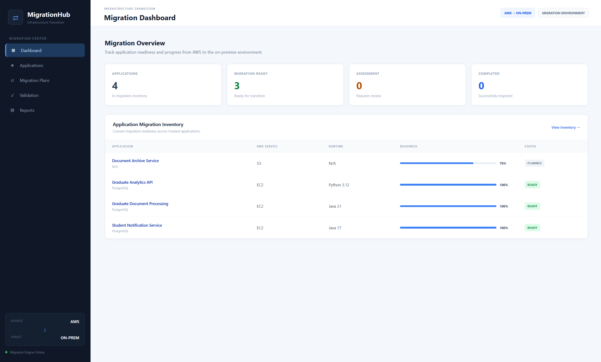
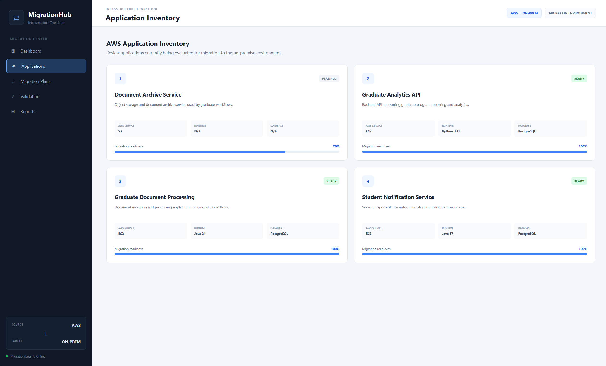
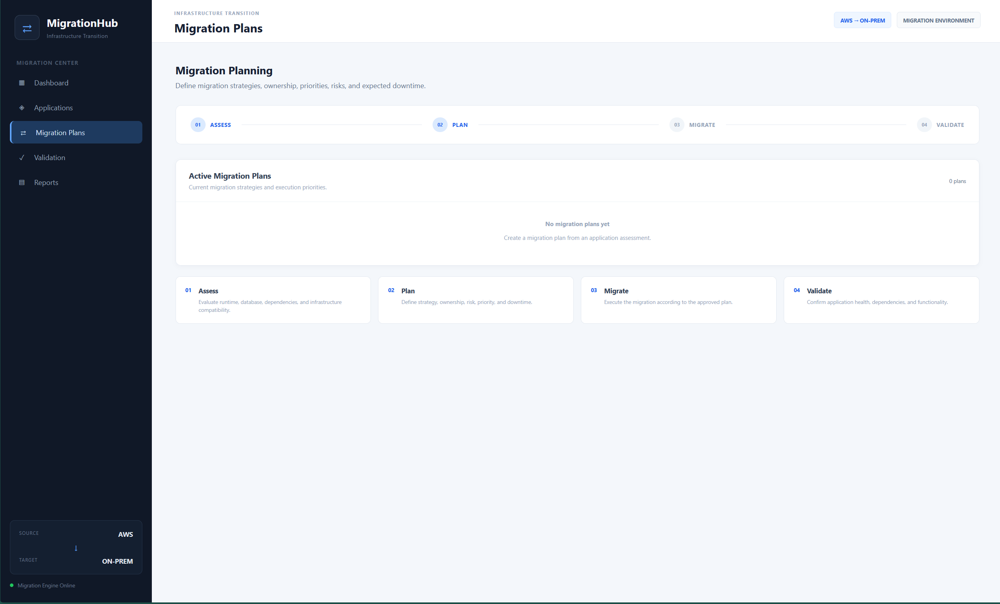
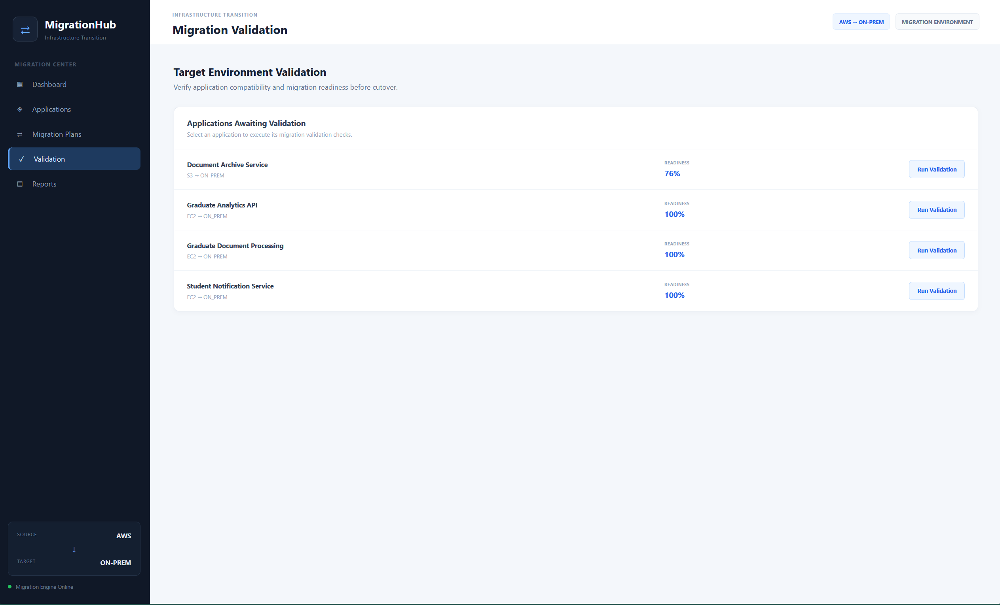
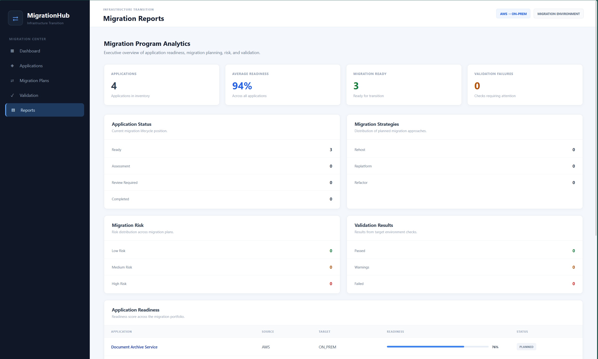

# AWS-to-On-Prem Migration Control Center

A full-stack IT migration management platform designed to support the assessment, planning, validation, and reporting of application migrations from **AWS/cloud environments to on-premises infrastructure**.

The platform provides a centralized workflow for evaluating application readiness, defining migration strategies, identifying risks and dependencies, validating target-environment compatibility, and generating operational reports.

---

## Overview

MigrationHub models an enterprise application migration lifecycle:

```text
┌──────────────────────┐
│     AWS / Cloud      │
│     Applications     │
└──────────┬───────────┘
           │
           ▼
┌──────────────────────┐
│ Application Inventory│
└──────────┬───────────┘
           │
           ▼
┌──────────────────────┐
│ Readiness Assessment │
└──────────┬───────────┘
           │
           ▼
┌──────────────────────┐
│  Migration Planning  │
│ Strategy / Risk /    │
│ Priority / Downtime  │
└──────────┬───────────┘
           │
           ▼
┌──────────────────────┐
│      Validation      │
│ Runtime / Database / │
│ Dependencies / Config│
└──────────┬───────────┘
           │
           ▼
┌──────────────────────┐
│    On-Premises       │
│     Environment      │
└──────────────────────┘
```

---

## Key Features

* Application inventory and lifecycle tracking
* AWS-to-on-premises migration planning
* Automated migration-readiness assessment
* Application compatibility validation
* Migration strategy management
* Risk and priority tracking
* Estimated downtime tracking
* Migration ownership tracking
* Application dependency management
* Migration activity logging
* Target-environment validation
* Operational dashboards
* Migration portfolio reporting
* REST API backend
* PostgreSQL persistence
* Responsive web interface

---

## Technology Stack

**Backend**

* Python
* FastAPI
* SQLAlchemy
* PostgreSQL

**Frontend**

* HTML
* CSS
* JavaScript
* Jinja2 Templates

**Infrastructure / Cloud**

* AWS
* AWS-to-On-Premises Migration Architecture

**Development**

* REST APIs
* Git
* GitHub

---

## Migration Lifecycle

### 1. Application Inventory

Applications are maintained in a centralized inventory containing information such as:

* Application name
* Description
* AWS service
* Runtime
* Database
* Source environment
* Target environment
* Migration status
* Readiness score

---

### 2. Readiness Assessment

Each application can be evaluated to determine how prepared it is for migration.

The assessment considers application and infrastructure characteristics and produces a migration-readiness score.

```text
Application
     │
     ├── Runtime
     ├── Database
     ├── Dependencies
     ├── Configuration
     └── Target Environment
              │
              ▼
       Readiness Assessment
              │
              ▼
        Readiness Score
```

---

### 3. Migration Planning

Migration plans define how an application will transition to the target environment.

Supported strategies include:

| Strategy   | Description                         |
| ---------- | ------------------------------------ |
| REHOST     | Lift-and-shift migration            |
| REPLATFORM | Minor optimization during migration |
| REFACTOR   | Architectural modification          |

Plans also track:

* Priority
* Risk level
* Estimated downtime
* Migration owner
* Implementation notes
* Plan status

---

### 4. Dependency Management

Application dependencies are tracked to identify components that must be available in the target environment.

Dependency information can include:

* Dependency name
* Dependency type
* Source environment
* Target environment
* Readiness status

This helps identify migration blockers before application cutover.

---

### 5. Automated Validation

MigrationHub provides automated validation checks across **6 compatibility areas**:

1. Runtime compatibility
2. Database compatibility
3. Target environment
4. Dependency readiness
5. Migration plan availability
6. Application configuration

Each validation check produces one of three outcomes:

```text
PASS
WARNING
FAIL
```

The individual results are aggregated into an overall migration validation status.

---

### 6. Reporting

The reporting dashboard provides visibility into the migration portfolio.

Reports include:

* Total applications
* Average readiness
* Migration-ready applications
* Applications requiring review
* Migration strategy distribution
* Risk distribution
* Validation results
* Application readiness
* Recent migration activity

---

## Application Architecture

```text
                ┌─────────────────────┐
                │      Web Browser    │
                │    HTML / CSS / JS  │
                └──────────┬──────────┘
                           │
                           ▼
                ┌─────────────────────┐
                │       FastAPI       │
                │   Routes / APIs     │
                └──────────┬──────────┘
                           │
                           ▼
                ┌─────────────────────┐
                │   Business Logic    │
                │ Assessment / Plans  │
                │ Validation / Reports│
                └──────────┬──────────┘
                           │
                           ▼
                ┌─────────────────────┐
                │     SQLAlchemy      │
                │        ORM          │
                └──────────┬──────────┘
                           │
                           ▼
                ┌─────────────────────┐
                │     PostgreSQL      │
                └─────────────────────┘
```

---

## Project Structure

```text
MigrationHub/
│
├── app.py
├── database.py
├── models.py
├── migration.py
├── monitoring.py
├── requirements.txt
│
├── templates/
│   ├── base.html
│   ├── dashboard.html
│   ├── applications.html
│   ├── application_detail.html
│   ├── plans.html
│   ├── validation.html
│   └── reports.html
│
└── static/
    ├── css/
    │   └── style.css
    │
    └── js/
        └── app.js
```

---

## Screenshots

### Dashboard



### Application Assessment



### Migration Planning



### Migration Validation



### Migration Reports



> Screenshots are stored in the `screenshots/` directory.

---

## Running Locally

### Requirements

* Python 3.10+
* PostgreSQL
* Git
* Virtual environment support

### Clone the repository

```bash
git clone https://github.com/toastedjames/AWS-On-Prem-Migration-Control-Center.git
cd AWS-On-Prem-Migration-Control-Center
```

### Create a virtual environment

Windows:

```powershell
python -m venv venv
```

Activate it:

```powershell
.\venv\Scripts\Activate.ps1
```

### Install dependencies

```powershell
pip install -r requirements.txt
```

### Configure PostgreSQL

Create a PostgreSQL database and configure the application's database connection according to the local configuration used by the project.

Do not commit:

* Database passwords
* API keys
* Access tokens
* Other credentials

### Start the application

```powershell
python -m uvicorn app:app --reload
```

The application will be available at:

```text
http://127.0.0.1:8000
```

---

## Example Workflow

```text
1. Add Application
        ↓
2. Review Application Profile
        ↓
3. Run Readiness Assessment
        ↓
4. Review Readiness Score
        ↓
5. Identify Dependencies
        ↓
6. Create Migration Plan
        ↓
7. Define Risk / Priority / Downtime
        ↓
8. Run Validation
        ↓
9. Review Validation Results
        ↓
10. Monitor Migration Activity
        ↓
11. Generate Migration Reports
```

---

## Engineering Focus

MigrationHub was developed to demonstrate practical experience in:

* IT application development
* Cloud migration planning
* AWS-to-on-premises transition workflows
* Backend API development
* Database-backed business applications
* Application readiness assessment
* Infrastructure compatibility validation
* Dependency management
* Risk analysis
* Operational reporting
* IT workflow automation
* Full-stack web application development

---

## Future Improvements

Potential future enhancements include:

* AWS service API integration
* Microsoft 365 / Microsoft Graph integration
* Automated migration execution
* Enterprise authentication
* Role-based access control
* CI/CD integration
* Automated testing
* Migration scheduling
* Approval workflows
* Enterprise ticketing-system integration
* Automated email notifications
* Cloud vs. on-premises health comparison

---

## Author

**Somak Goswami**

M.S. Electrical Engineering
Virginia Tech

---

## License

This project is intended as a portfolio and educational project.
